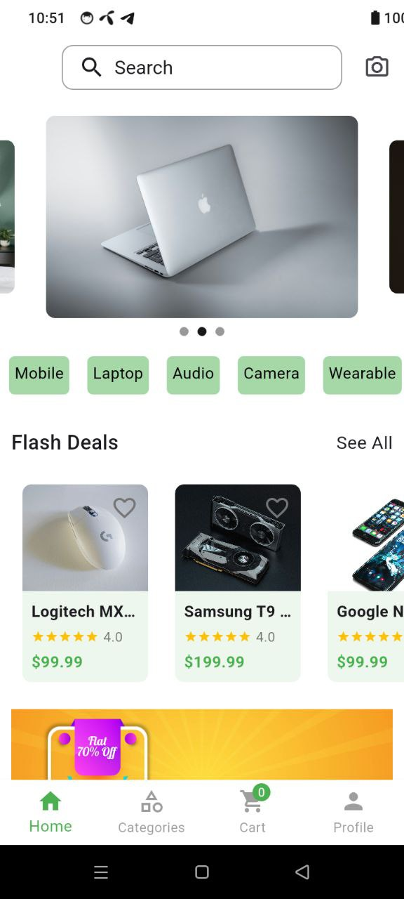
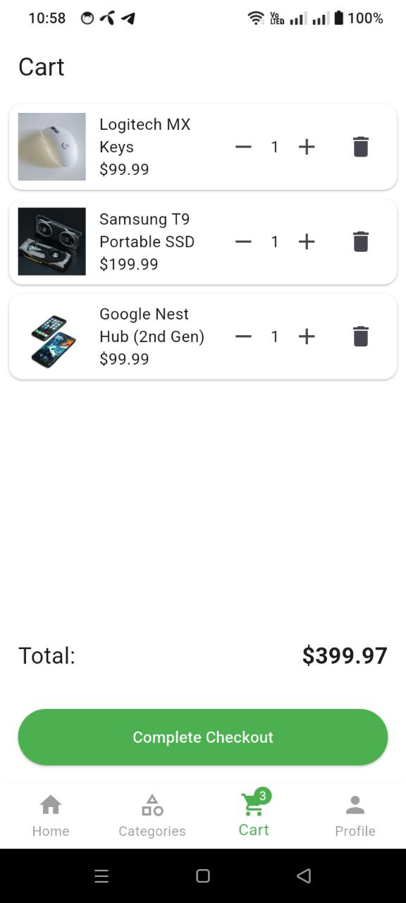
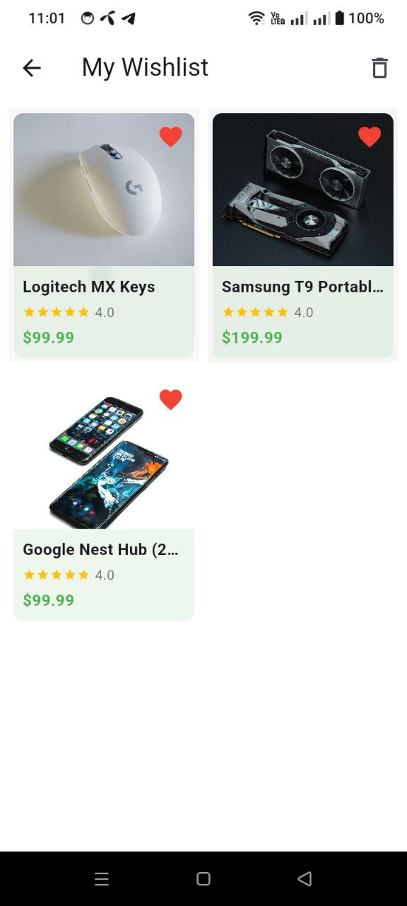
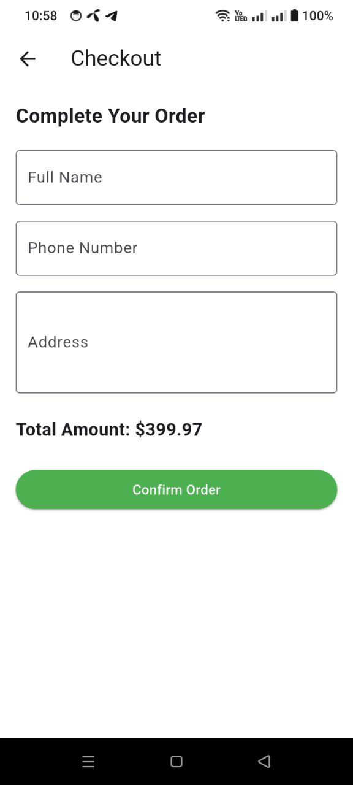
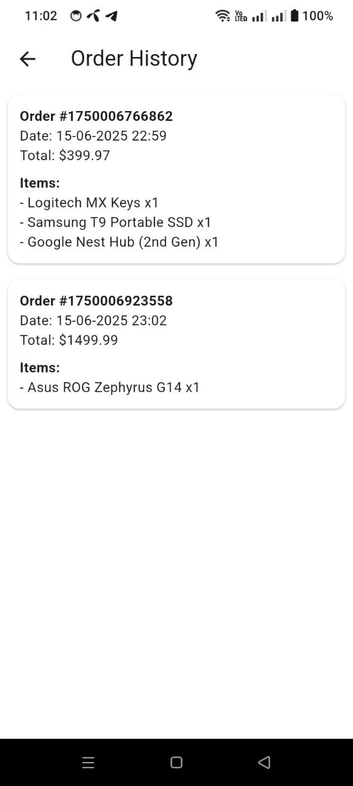
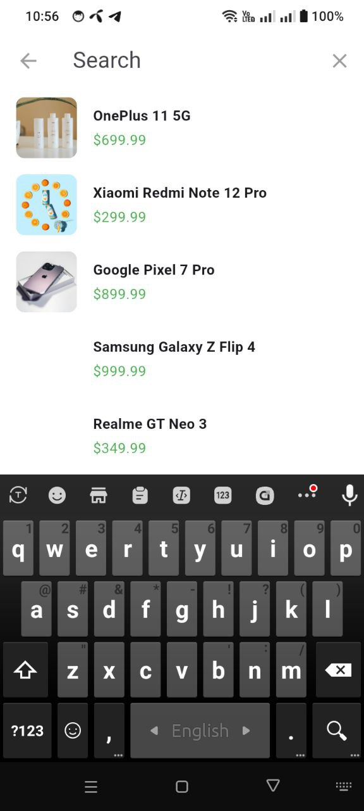
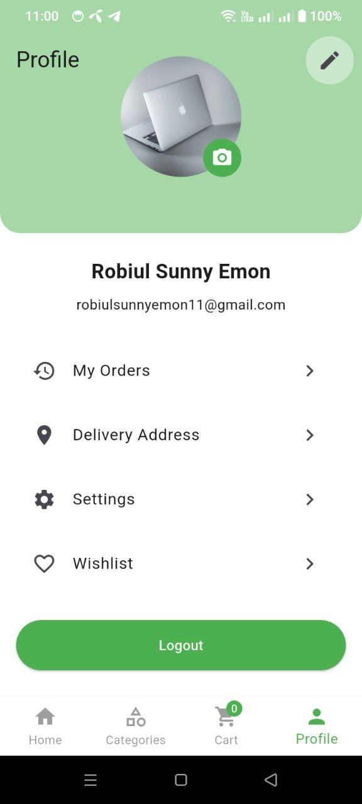
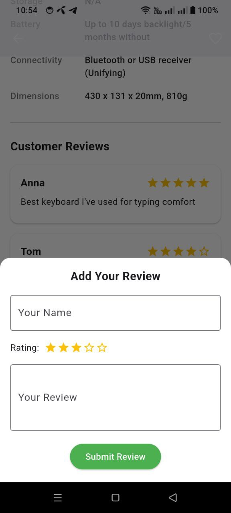
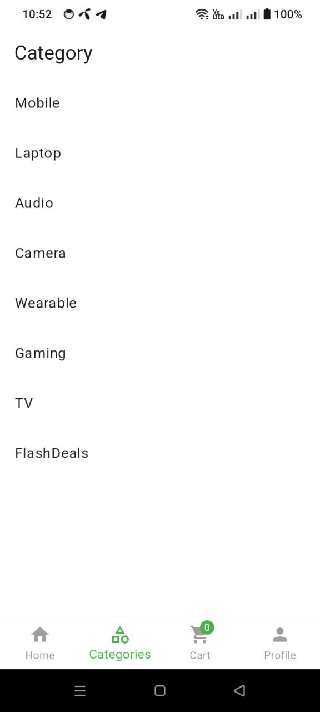
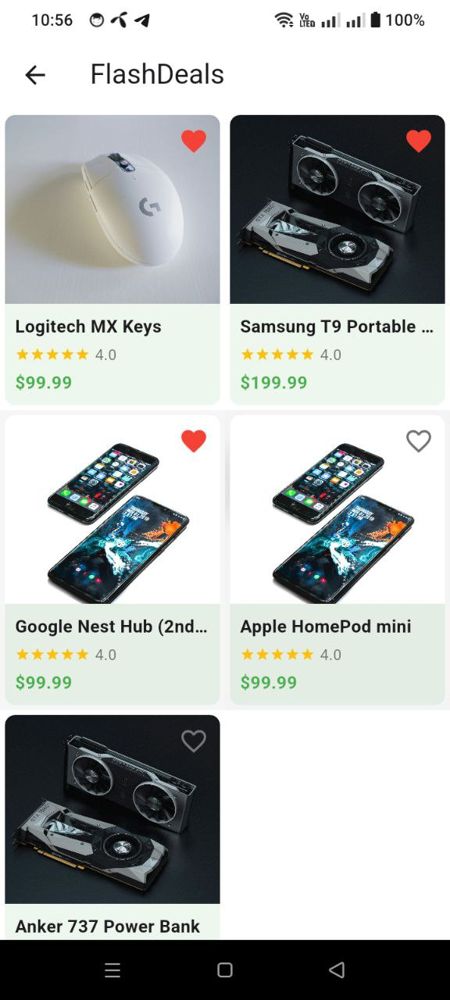

# Dhaka Shop - Flutter E-Commerce App

[](https://github.com/yourusername/dhaka-shop)
[](https://github.com/yourusername/dhaka-shop/actions)
[](https://opensource.org/licenses/MIT)

A full-featured e-commerce application built with Flutter, optimized for Bangladeshi users.

## 📸 Screenshots

<div align="center">
  <table>
    <tr>
      <td></td>
      <td></td>
      <td></td>
    </tr>
    <tr>
      <td></td>
      <td></td>
      <td></td>
    </tr>
    <tr>
      <td></td>
      <td></td>
      <td></td>
    </tr>
    <tr>
      <td></td>
      <td></td>
      <td></td>
    </tr>
  </table>
</div>

## ✨ Features

- **Product Browsing**: Browse products by categories
- **Search Functionality**: Quick product search
- **Wishlist**: Save favorite products
- **Cart System**: Add products to cart
- **Order Management**: Track your orders
- **Profile Management**: Update user profile
- **Rating System**: 4-star rating implementation

## 🛠️ Technologies

- **Frontend**: Flutter (Dart)
- **State Management**: GetX
- **Local Storage**: SharedPreferences, GetStorage
- **Image Loading**: CachedNetworkImage
- **API Client**: Dio/Http
- **Dependency Management**: Pub

## 🚀 Installation

```bash
git clone https://github.com/robiulsunnyemon/dhaka_shop.git
cd dhaka-shop
flutter pub get
flutter run
```
## 📂 Project Structure
```
lib/
├── app/
│   ├── modules/
│   │   ├── home/
│   │   ├── product/
│   │   ├── cart/
│   │   ├── wishlist/
│   │   └── ...
│   ├── routes/
│   └── widgets/
├── data/
│   ├── model/
│   └── services/
└── main.dart

```
## 💻 Key Code Snippets
### Product Card with 5-Star Rating
```
// lib/app/component/product_card.dart

ProductCard(
  product: product,
  rating: 5.0, // Fixed 4-star rating
)
```
### GetX Controller
```
// lib/app/modules/home/controllers/home_controller.dart

class HomeController extends GetxController {
  final products = <Product>[].obs;
  // ...
}
```
## 🤝 Contributing Fork the repository

- Create your feature branch (git checkout -b feature/AmazingFeature)

- Commit your changes (git commit -m 'Add some AmazingFeature')

- Push to the branch (git push origin feature/AmazingFeature)

- Open a Pull Request

## 📄 License
#### Distributed under the MIT License. See LICENSE for more information.

- ✉️ Contact
- Email: robiulsunnyemon11@gmail.com

GitHub: @robiulsunnyemon